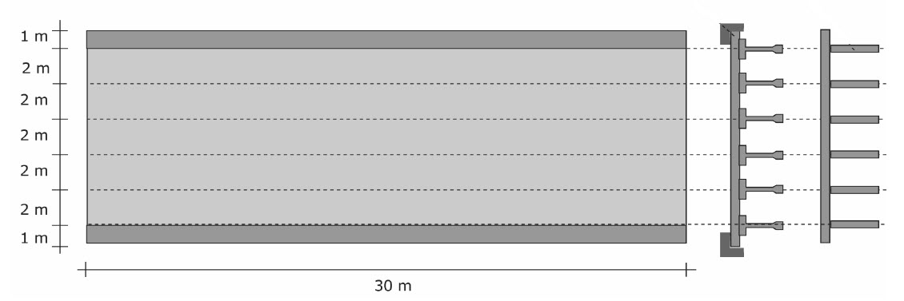
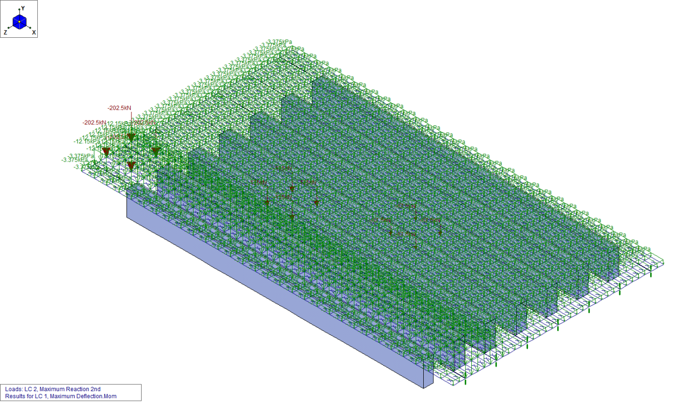

During the last semester of my studies in DUTH, in the scope of the structural engineering specialization, I was involved along with [Evripidis Apostolidis](https://gr.linkedin.com/in/evripidis-apostolidis-357619bb) in the design of a pre-stressed concrete road bridge.

The project included the total bridge dimensioning, from the geometry to the pre-stressing concept and the reinforcement design. The structural concept was pre-stressed beams in the longitudinal direction, whereas on the transverse direction the spans were gaped with normal reinforcement.

*Main structural concept*

The loads and load cases were defined according to the Eurocode 0 and 1, and appropriate bearings were defined from the Mageba catalogue.

*Example of load case 2*

The cross-section design, as well as the concrete plate simulation and the internal forces were defined with the help of an appropriate Finite Element program (Risa 3D).

>[Pre-stressing concept](../assets/pdfs/con_bridges/pre-stressing_concept.pdf) 
>[Abutment design](../assets/pdfs/con_bridges/abutment_design.pdf) 
>[Transversal reinforcement according to the moment envelope](../assets/pdfs/con_bridges/transverse_moment_envelope.pdf) 

*A selection of drawings (in greek language).*
