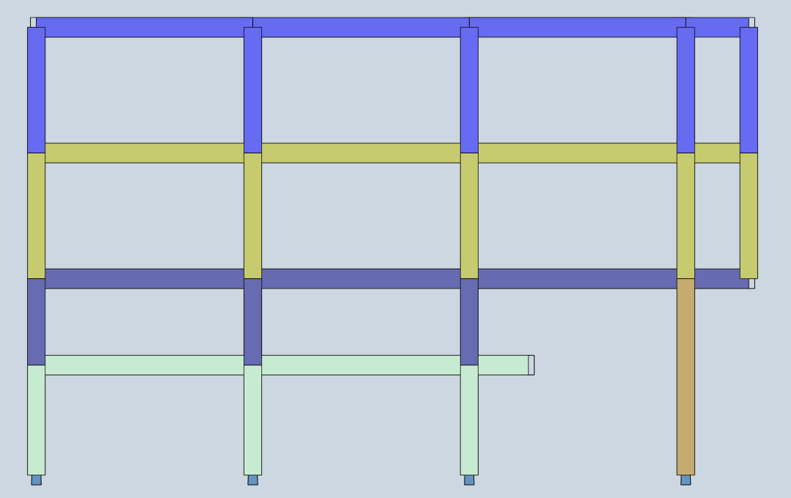
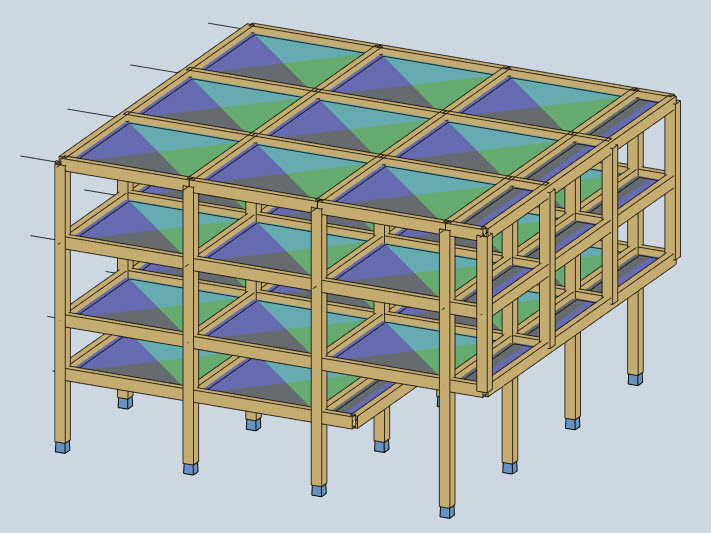
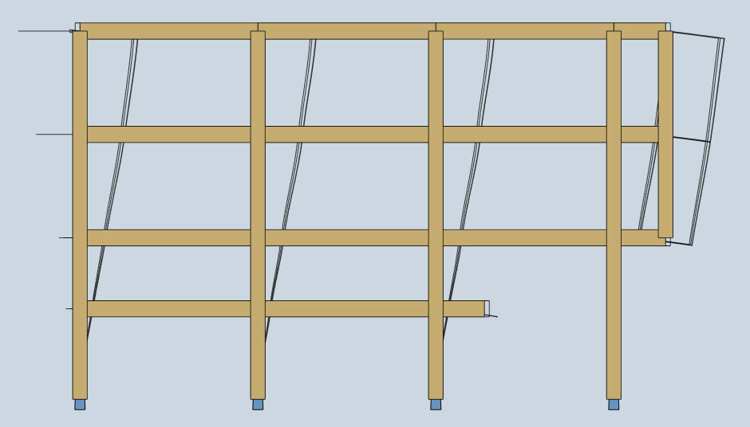

---------------------------------------------------------------------
Feb. 2013-June 2014
  : **Xanthi, Greece**

---------------------------------------------------------------------

Along with the other specialized courses in the last semester of my studies in DUTH ([Reinforced and Pre-stressed Concrete
Bridge Engineering](../../con_bridges/), [Special Elements of Steel Structures](../../xanthi3)), I followed the Reinforced Concrete Structures III (design
for seismic actions) course, that investigates specific earthquake design topics mainly in concrete design.

In the scope of this course a multi-storey building with irregularities (such as variable stiffness distribution along the height) was simulated and designed, in order to familiarize with specific topics in earthquake engineering. Different analysis methods, as well as all design details according to Eurocode 8 (Sections 1 to 5) were thoroughly discussed.  

*Typical frame of the building (colours represent different floors used for the mass distribution, as well as for the primary and secondary bearing structural elements)*

Multiple analysis methods were examined and compared, from the Equivalent Lateral Force Method (ELFM) to Time History Analysis methods, in order to investigate the influence of irregularities (free cantilever of the entresol and 1st/2nd floor balconies). Moreover, the influence of the vertical earthquake component was examined too.

*Automatic load distribution from the plates (used as diaphragms in every floor level), to the beams and columns.*

Although the building was simulated 100% in 3D, the results were verified by hand calculations, where possible. Finally, the design was made with hand calculations for specific elements, using the automatic Excell process described in [RC 1B/1C project](../../kos1bg/).

*Deformations of a typical frame for the 1X+0.3Y load combination according to Eurocode 8 (note the automatic load generation of the ELFM)*
