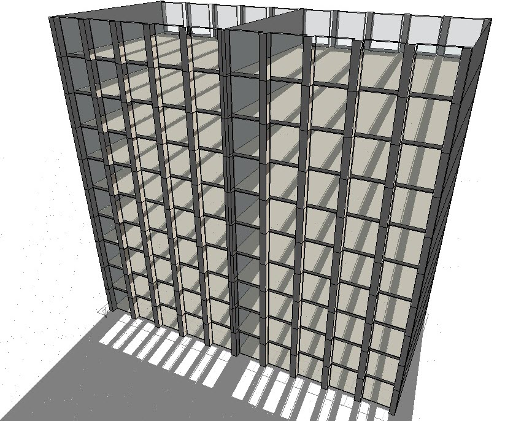
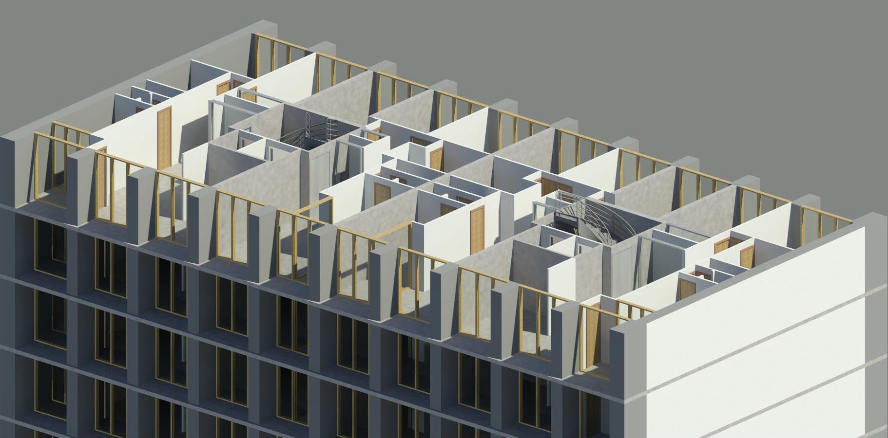

---------------------------------------------------------------------
Febr. 2015-Juni 2015
  : **Zurich, Switzerland**

---------------------------------------------------------------------

As part of the Project Work at IBI during my Master studies at ETH, I studied the thermal performance of a limestone building using Building Information Modelling processes, in order to evaluate and select an optimal intervention strategy. Both the modelling and the analysis were conducted using Autodesk Revit, for the modelling part, and Autodesk Ecotect for the analysis part, now incorporated in the Revit package.
As far as the reference building is concerned, it belongs to the Copropriété Résidence du Parc, Meudon-la-Forêt building complex in Paris, France. The actual building was originally designed and constructed under the supervision of the French architect Fernand Pouillon during 1957-62.

Actual building             |  Ecotect model
:-------------------------:|:-------------------------:
  |  

*Reference building of the Copropriété Résidence du Parc, Meudon-la-Forêt complex in Paris, France.*

The interventions investigated included the replacement of the single with double glazed windows, the introduction of thermal mass on the glass façade with the form of limestone walls as well as the improvement of the ceiling and side walls insulation.

*Revit visualization of the interior of a typical floor.*

The study concluded that the most advantageous cost-effective intervention was the replacement of the single with double glazed windows. However, when the cost factor is not the driving one, each intervention strategy presents its own major advantage. Especially, the effects of thermal mass design by covering a part of the glass façade with limestone walls showed inarguably very interesting advantages enabling a more uniform temperature throughout the daily building usage.
