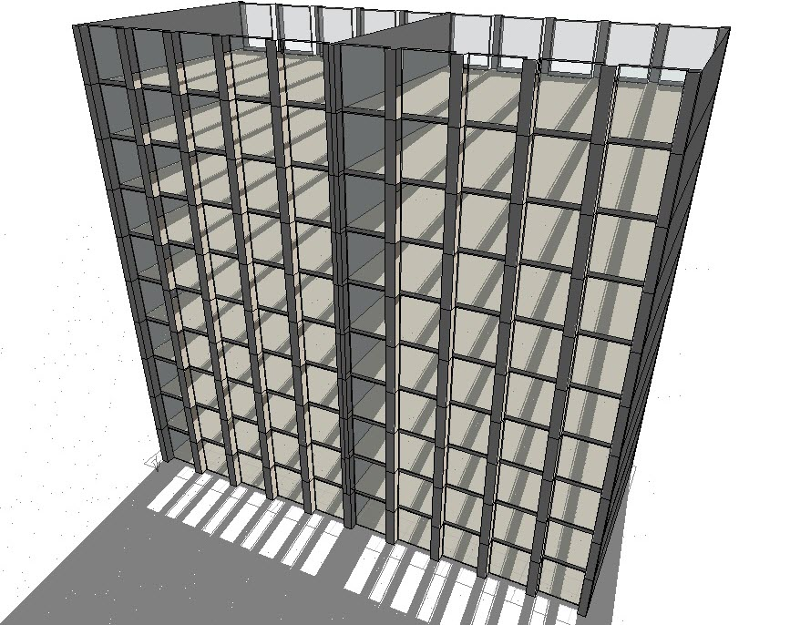
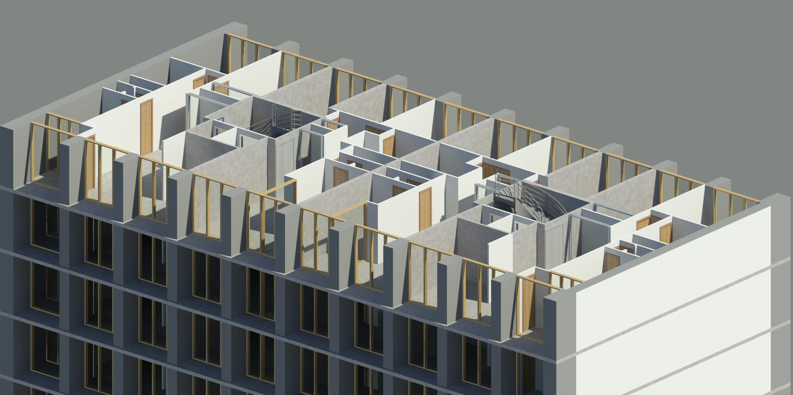

[wisba_logo]: ../assets/images/wisba_logo.jpg
{: width="130px"}

## Wienerberger Sustainability Building Academy

  

---

Sept. 2015-Feb. 2016
  : **Zurich, Switzerland**
  : **Budapest, Hungary**
  : **Pisa, Italy**
  : **Vienna, Austria**

During my 3rd Master semester I was selected, together with another 23 students from ETH, Austrian, Belgian, Italian, Hungarian and Polish universities, to participate in a multidisciplinary European project, regarding future "climate change" and "change of use" scenarios. The project was funded entirely by [Wienerberger](http://www.wienerberger.com/) and [Building 2226](http://www.baumschlager-eberle.com/en/projects/project-details/project/buerogebaeude.html) by [Baumschlager Eberle](http://www.baumschlager-eberle.com/en.html) was selected as a benchmark for research. The later is a revolutionary office building located in Lustenau, Austria, incorporating a low-tech concept by having no active heating or cooling systems installed. Instead, a sophisticated software inspects 24/7 all vital psychrometric values, allowing fresh air to enter the building, when necessary, to maximize the user comfort. Together with local materials and novel insulation concepts, a temperature between 22-26°C is guaranteed all year long, hence the name Building 2226.

*Building 2226*

The assembled team was split in two 12-student groups and our task was the examination of the aforementioned scenarios, based on the Building 2226 concept, for a potential implementation in the future.

I was part of the "climate change" team, responsible for the Life Cycle Costing of the proposed scenario, as well as part of the Building Information Modelling group. Team work, however, has been crucial to accomplish all tasks, adding on top of the aforementioned ones the Life Cycle Analysis, Energy Analysis and Comfort.

*Workflow of "Climate Change" group.*

Study of the thermal behaviour of the 60yr-old residential stone building Résidence du Parc using BIM process
---------------------------------------------------------------------

Febr. 2015-Juni 2015
  : **Zurich, Switzerland**

As part of a Semester Project during my Master studies at ETH, I studied the thermal performance of a limestone building using Building Information Modelling processes, in order to evaluate and select an optimal intervention strategy. Both the modelling and the analysis were conducted using Autodesk Revit, for the modelling part, and Autodesk Ecotect for the analysis part, now incorporated in the Revit package.
As far as the reference building is concerned, it belongs to the Copropriété Résidence du Parc, Meudon-la-Forêt building complex in Paris, France. The actual building was originally designed and constructed under the supervision of the French architect Fernand Pouillon during 1957-62.

Actual building             |  Ecotect model
:-------------------------:|:-------------------------:
  |  

*Reference building of the Copropriété Résidence du Parc, Meudon-la-Forêt complex in Paris, France.*

The interventions investigated included the replacement of the single with double glazed windows, the introduction of thermal mass on the glass façade with the form of limestone walls as well as the improvement of the ceiling and side walls insulation.

*Revit visualization of the interior of a typical floor.*

The study concluded that the most advantageous intervention was the replacement of the single with double glazed windows. Moreover the effects of thermal mass design were examined in order to evaluate the intervention of covering a part of the glass façade with limestone walls.
