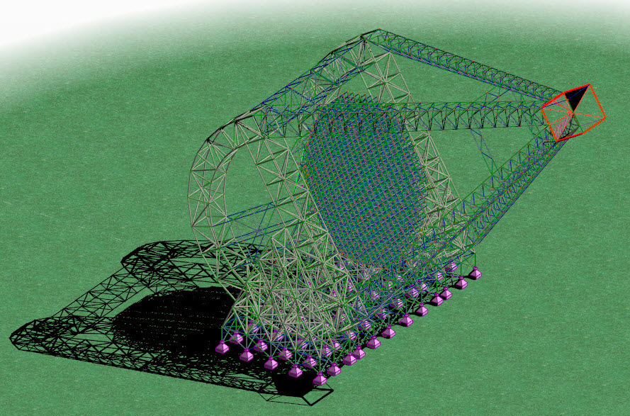

As part of my obligatory Project Work in the Structural Engineering Institute of ETH, I got involved in, what in the future emerged as my Master thesis too, an interdisciplinary project with the Institute of Particle Physics. This Project Work was accomplished as a team work with my colleague Georgios Zinas.

The project of a gigantic ground based Gamma-Ray telescope was initiated from a revolutionary camera technology developed by the Institute of Particle Physics, and more precisely Adrian Biland's group. This camera allows more relaxed geometrical constraints, compared to a traditional altazimuth mounted telescope, such as the deformations of the main dish structure.

{: .align-left}
*Sebastian Achim Mueller's drawing of the new instrument*

{: .align-left}
*Investigation of the spatial positions of the new instrument.*

In this first approach, the goal was a rough design of a 50m diameter altazimuth and novel mount telescope and their comparison, in order to prove the benefits of the novel structural concept.

Altazimuth concept             |  CRM/RCS concept
:-------------------------:|:-------------------------:
  |  

The advantage of the new concept derives from the separation of the camera structure, namely Robocrane Camera Structure (RCS) and the reflector structure, namely Cable-Robo-Mount (CRM), which is allowed from the relaxed deformation constraints, due to the novel camera technology. The RCS is responsible for holding and positioning the camera, whreas the CRM performs the same functions for the reflector. The reflector is segmented and the mirror facets are supported on a square-on-offset-square space frame, which is supported on a circumferential ring, namely the tension ring.

Visualization             |  Finite Element Modell
:-------------------------:|:-------------------------:
  |  

The whole dish is suspended via cables from peripheral columns, which allows an even spread of stresses on the reflector that results in homogeneous deformations. On the other hand, a traditionally mounted reflector is supported on one elevation axis which results in concentrated stresses on the supporting points. The later, results in differential settlements, distorting the reflector shape.

Visualization of the two concepts (Altazimuth top and CRM/RCS bottom)           |
:-------------------------:|
  |
  |

The results proved the expected function of the novel structural system, although the need of connecting the astrophysical quantity of observation quality with the deformations was underlined, in order to justify the results. Another crucial point was the investigation of the maximum feasible reflector diameter, which will magnify the performance of the instrument. The later conclusions sparked the interest for a [parametric study and optimization for such an instrument](../telescope2/).
