---------------------------------------------------------------------
Sept. 2016-Mar. 2017
  : **Zurich, Switzerland**

---------------------------------------------------------------------

The work of my Masterthesis at ETH was the sequel of the [Project Work in the Structural Engineering](../telescope1/) Institute of ETH. During this previous work, a comparison analysis of a traditional and a novel telescope structural system was performed proving the huge benefits of the later.

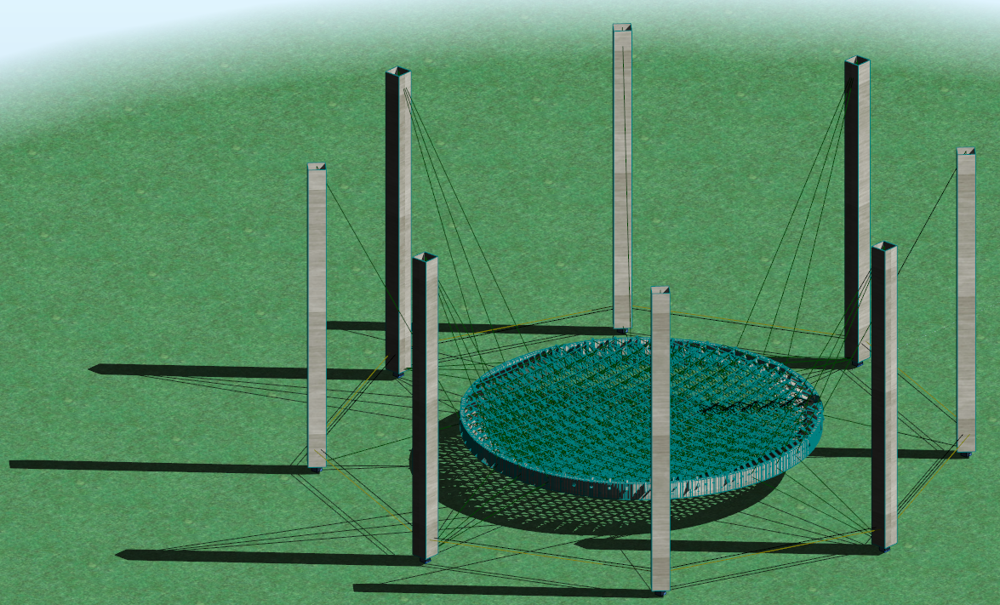
*Visualization of the novel CRM concept*

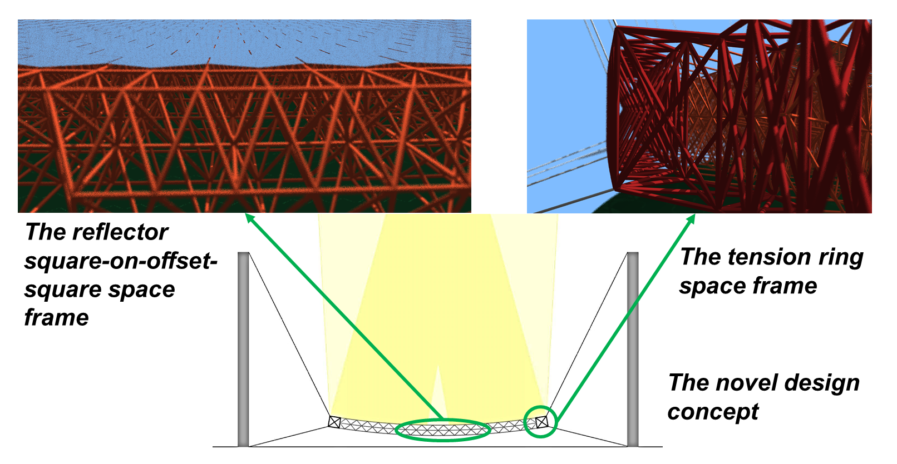
*Reflector parts description*

This study focuses on the investigation and optimization of the largest possible ground based Gamma-Ray telescope, based on this unique structural concept, named Cable-Robot-Mount (CRM). The examination of such a problem lies in the structural optimization branch, although it gets more complicated as optical quality considerations deriving from the structure's deformations have to be taken into account. In other words, for a non deformable structure all photon rays coincide in the camera focal length point, whereas in a real structure they spread around this point, due to the inevitable structure flexibility.

To establish a communication interface between the optical and structural disciplines of the problem, common ground had to be found in how each constraint is translated for the affiliated groups. With the development of a simulation tool, the structural and optical considerations are numerically translated and a closed loop in form of a complex, nonlinear multi-criteria optimization problem is constructed. For the problem solution, the [Particle Swarm Optimization](https://en.wikipedia.org/wiki/Particle_swarm_optimization) (PSO) algorithm is used.

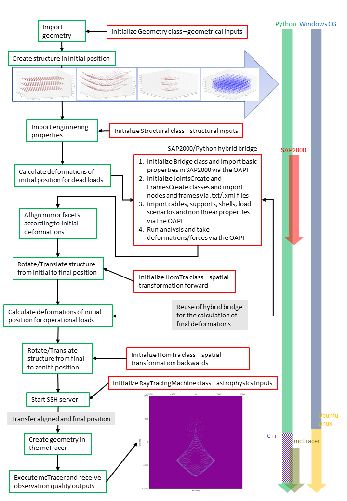
 
*The Optimisation framework workflow*

This tool allows a complete parametric study of the structural and geometrical properties of the concept and their influence in the observation quality.

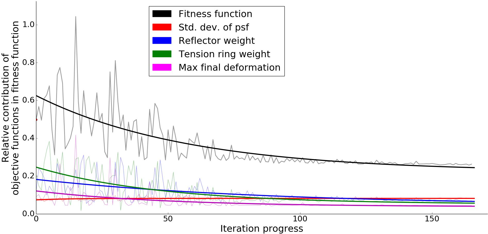
*The PSO algorithm in action (The Fitness function represents the overall convergence of the multi-objective optimisation problem and the Std. dev. of psf represents one objective function of the observation quality).*

The results show a great potential of the CRM concept. Specifically, reflectors with a diameter of up to 30m can be constructed with steel, without the aid of adaptive optics. The true capacity of this mount, however, is shown for carbon solutions, where reflector diameters up to 70m do not mandate actuators, improving the state of the art, in terms of Cherenkov aperture area, by a factor of 8. When, on the other hand, such systems are implemented, the diameter can range up to 100m, upgrading the current state of the art, in terms of Cherenkov aperture area, by a factor of more than 16. The importance of carbon is underlined and improvements in technical level for the Serviceability Limit State are also proposed.

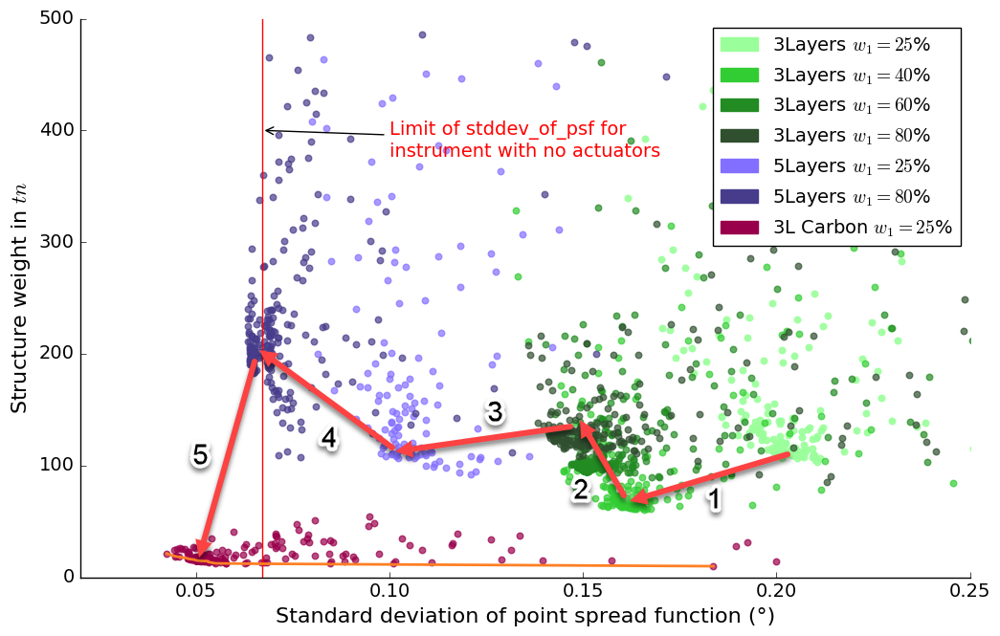
*Presentation of results for the 50m diameter telescope structure. Each point represents a completely different structural system e.g. truss topology, bar cross-section properties etc. 3 and 5 Layer space frames were examined. The x axis represents the observation quality (the closest to 0 the better).*

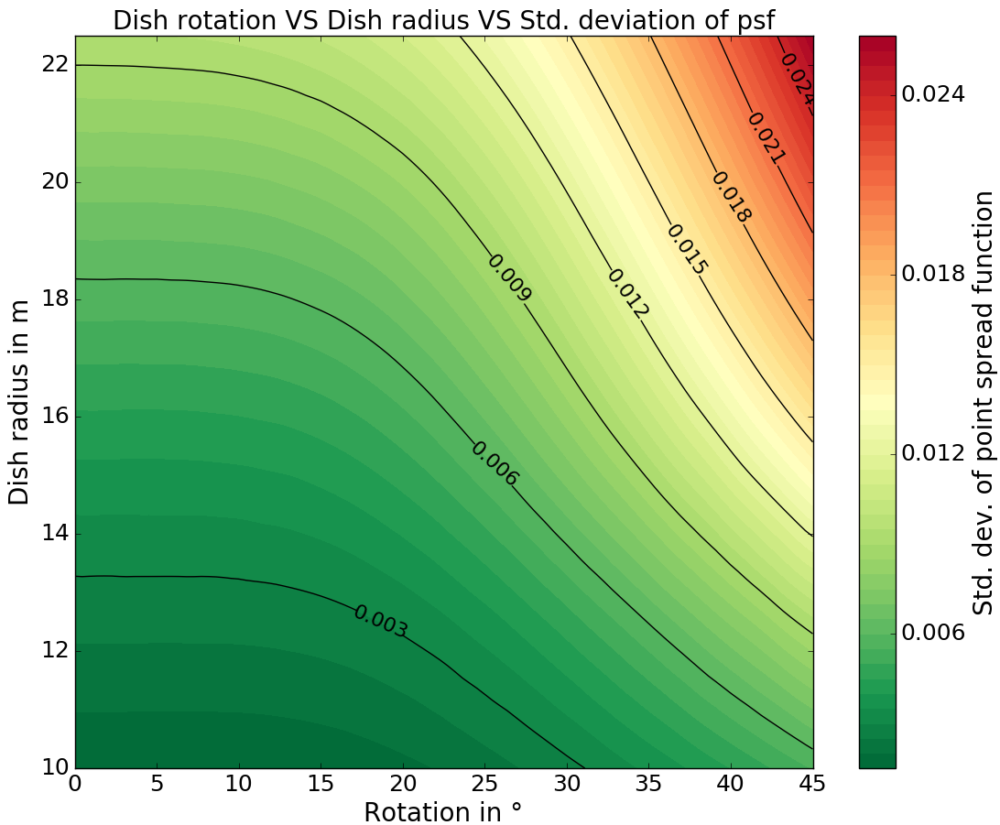
*Exploration of reflector spatial position (rotation) and diameter and their influence in the observation quality (colormap) with a brute force approach.*

**More Visualizations of the CRM concept**

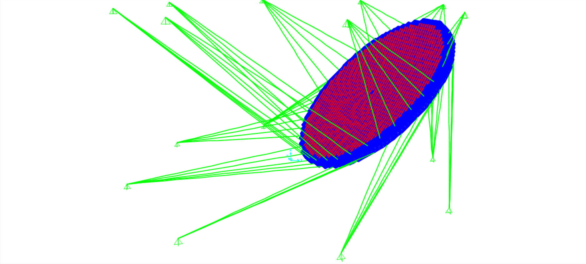
*Finite Element model of a 100m reflector in SAP2000 (in 45°).*
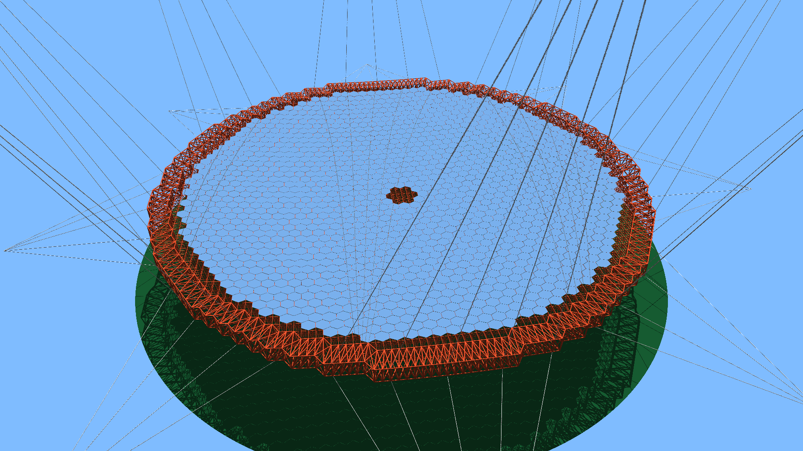
*Visualization of a 100m diameter reflector*
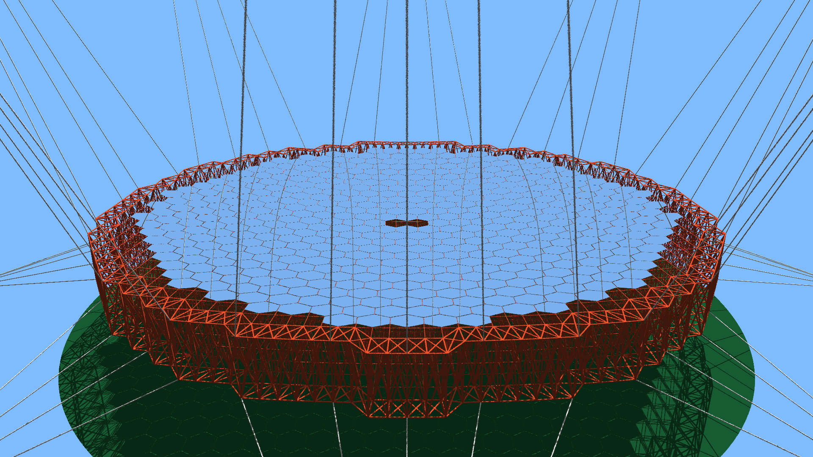
*Visualization of a 50m diameter reflector*
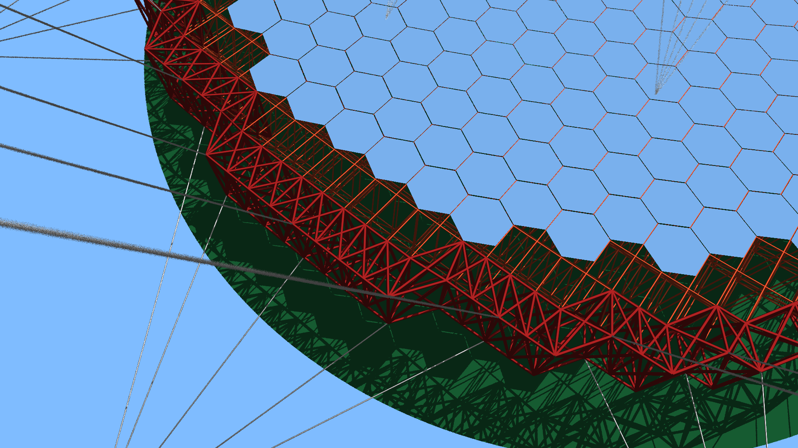
*A closer look to the tension ring and the main reflector square-on-offset-square space frame.*
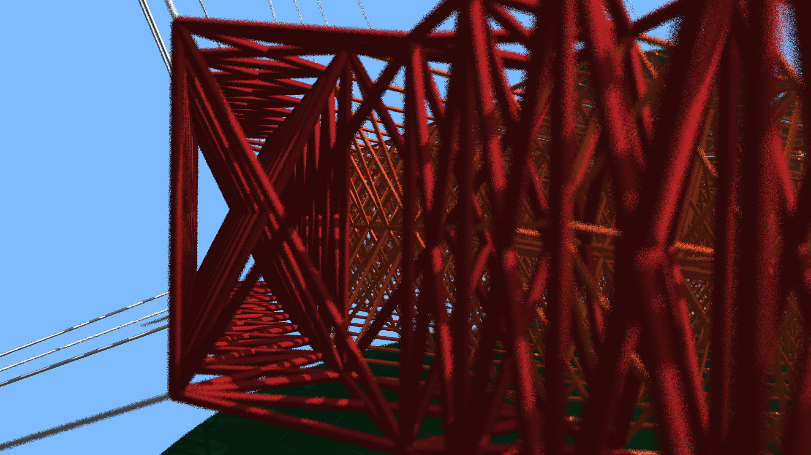
*A closer look to the tension ring space frame topology.*
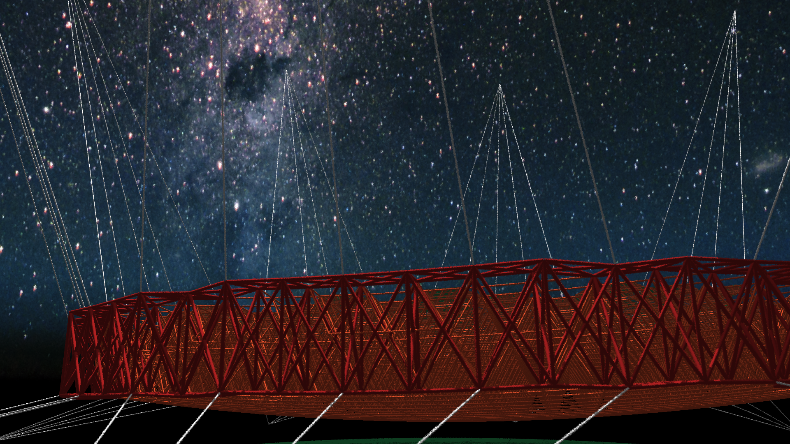
*Visualization of a 50m diameter reflector under the Chilean night sky.*
