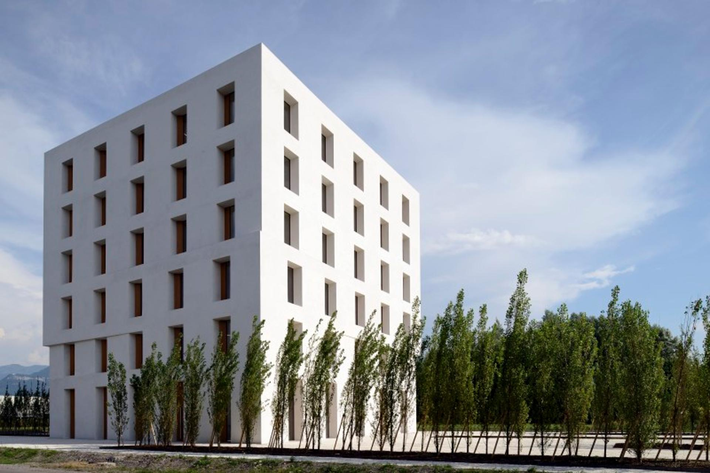
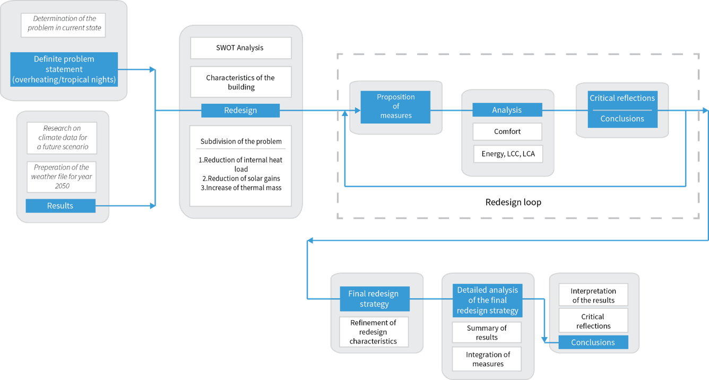

---------------------------------------------------------------------

Sept. 2015-Feb. 2016
  : **Zurich, Switzerland**
  : **Budapest, Hungary**
  : **Pisa, Italy**
  : **Vienna, Austria**

During my 3rd Master semester I was selected, together with another 23 students from ETH, Austrian, Belgian, Italian, Hungarian and Polish universities, to participate in a multidisciplinary European project, regarding future "climate change" and "change of use" scenarios. The project was funded entirely by [Wienerberger](http://www.wienerberger.com/) and [Building 2226](http://www.baumschlager-eberle.com/en/projects/project-details/project/buerogebaeude.html) by [Baumschlager Eberle](http://www.baumschlager-eberle.com/en.html) was selected as a benchmark for research. The later is a revolutionary office building located in Lustenau, Austria, incorporating a low-tech concept by having no active heating or cooling systems installed. Instead, a sophisticated software inspects 24/7 all vital psychrometric values, allowing fresh air to enter the building, when necessary, to maximize the user comfort. Together with local materials and novel insulation concepts, a temperature between 22-26°C is guaranteed all year long, hence the name Building 2226.

*Building 2226*

The assembled team was split in two 12-student groups and our task was the examination of the aforementioned scenarios, based on the Building 2226 concept, for a potential implementation in the future.

I was part of the "climate change" team, responsible for the Life Cycle Costing of the proposed scenario, as well as part of the Building Information Modelling group. Team work, however, has been crucial to accomplish all tasks, adding on top of the aforementioned ones the Life Cycle Analysis, Energy Analysis and Comfort.

*Workflow of "Climate Change" group.*
