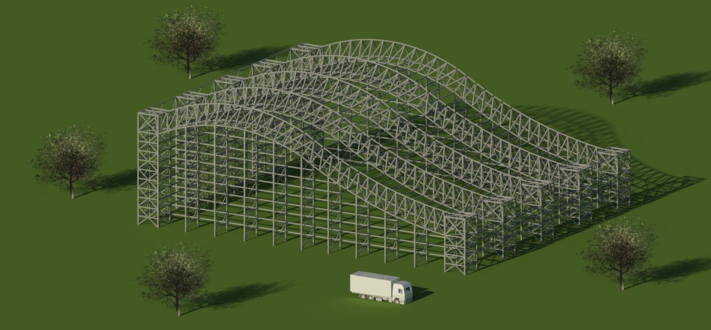
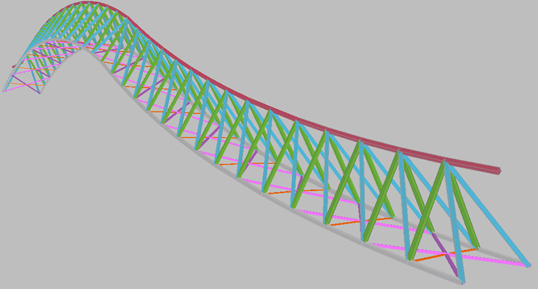
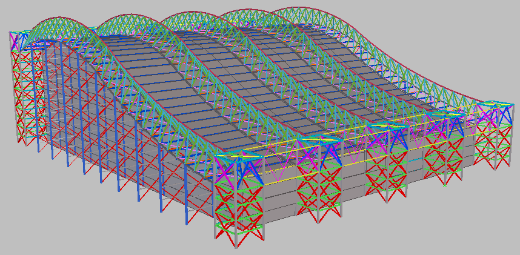

---------------------------------------------------------------------

Sept. 2013-April 2014
  : **Xanthi, Greece**

For my master thesis in Xanthi, Greece I was involved along with my colleague [Evripidis Apostolidis](https://gr.linkedin.com/in/evripidis-apostolidis-357619bb) in the design of a Swimming and Diving complex with stands using Building Information Modelling (BIM).

{: .align-center}

<i>3D visualization of the structure in Autodesk Revit.</i>

The floor plan is 50m x 70m and the main structure consists of 5 main frames spanning in the long direction. They are constructed with a simple 3D space truss maintaining a curved shape along their length, following the architectural constraints deriving from the diving facilities. The use of rectangular hollow cross sections for the main frames proved to be favourable, due to the avoidance of flexural buckling checks and less paint surface. The later was an influential cost factor, due to the hazardous, for steel cross sections, swimming facility environment.

{: width="600px" .align-center}

<i>Main frame 3D truss beam visualization in Tekla Structures.</i>

The structural concept can be seen from outside, meaning that the panel elements covering the structure are designed to be placed on the inside; the roof panels are suspended from the, Gerber-beam, purlins. The Finite Element simulation and design was performed in Autodesk Robot Structural Analysis and, afterwards, through the integrated BIM link, the model was transferred to Autodesk Revit for rendering purposes and further detailing.  

{: width="600px" .align-center}

<i>3D visualization and element grouping with the help of Tekla Structures.</i>

 In the final stage, the whole project was accomplished in a fabrication level with the help of BIM software Tekla Structures. A selection of two detailing plans are available for download as reference: 
 [3D plan of main frame (no cross sections)](../assets/pdfs/xanthi/3d_frame_layout1.pdf) 
 [front view of the main frame (with cross sections and dimensions)](../assets/pdfs/xanthi/view_cut_main_layout1.pdf)
