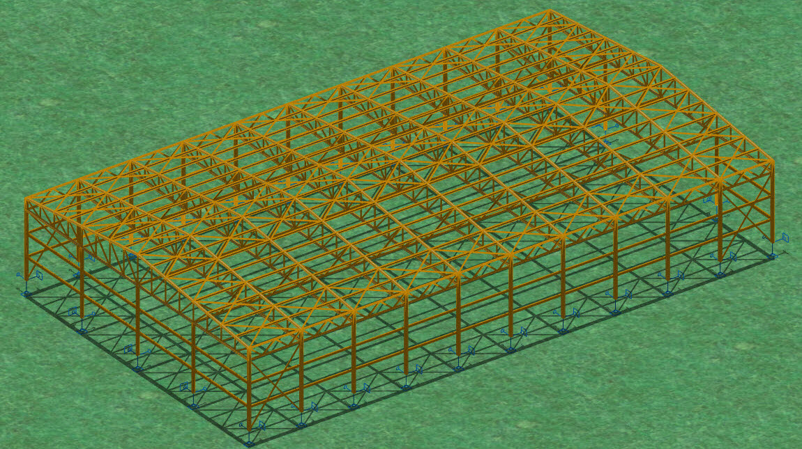

---------------------------------------------------------------------
Feb. 2013-June 2014
  : **Xanthi, Greece**

---------------------------------------------------------------------

During the course of Steel Structures 3 in DUTH, I was involved in the conceptual design of usual steel structures. My final project incorporated the knowledge that I had at that point, by designing a usual steel warehouse with dimensions 48m x 28m x 8.6m.

*Visualization of the structural concept.*

*0° and 90° side view of the structural system.*

*Top view with bracing concept.*

Typical structural details for reference 
[Bracing connection detail](../assets/images/xanthi3/det1.pdf) 
[Typical truss node connection](../assets/images/xanthi3/det2.pdf)
